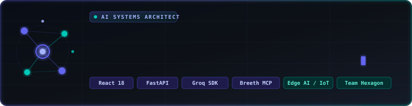
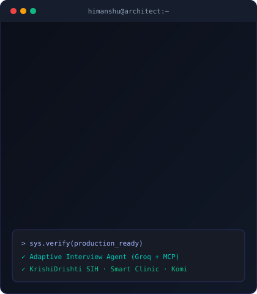

<div align="center">



<br/><br/>

<a href="https://github.com/HQHimanshu">
  
</a>

<br/>

<p>
  <a href="https://github.com/HQHimanshu?tab=followers"></a>
  &nbsp;
  
</p>

<p>
  <a href="https://github.com/HQHimanshu"></a>
  <a href="mailto:hhimanshuppandey@gmail.com"></a>
</p>

<p>
  <a href="https://github.com/HQHimanshu/KrishiDrishti"></a>
  <a href="https://adaptive-interview-agent.vercel.app/"></a>
  <a href="https://smart-clinic-dusky.vercel.app"></a>
  <a href="https://hqhimanshu.github.io/komi-app/"></a>
</p>

</div>

<br/>

## About

<table>
<tr>
<td width="55%" valign="top">

```typescript
const himanshu = {
  name:     "Himanshu Pandey",
  alias:    "@HQHimanshu",
  role:     "Full-Stack Engineer & AI Systems Builder",
  teams:    ["Team Hexagon", "Team Terminators"],
  focus: [
    "Agentic AI & memory (Groq LLMs, Breeth MCP)",
    "Full-stack web apps (React, FastAPI, Node)",
    "IoT + edge AI local inference (Ollama, RAG)"
  ],
  shipped:  "3 live apps built through hackathons",
  currently: "SIH PS-301 — KrishiDrishti",
  motto:    "Turn ambitious ideas into shipped software"
};
```

</td>
<td width="45%" align="center" valign="middle">

</td>
</tr>
</table>

I build systems at the intersection of **AI, full-stack engineering, and IoT** — with a bias toward shipping working products under hackathon-grade time pressure rather than polishing isolated demos.

<br/>

## Tech Stack

<div align="center">


<br/>

<br/>


<br/><br/>

<table>
<tr>
  <td align="center" width="140"><br/><sub>Groq LLM</sub></td>
  <td align="center" width="140"><br/><sub>Breeth MCP</sub></td>
  <td align="center" width="140"><br/><sub>ChromaDB RAG</sub></td>
  <td align="center" width="140"><br/><sub>Local Inference</sub></td>
  <td align="center" width="140"><br/><sub>Tesseract OCR</sub></td>
  <td align="center" width="140"><br/><sub>Twilio API</sub></td>
</tr>
</table>

</div>

<br/>

## Featured Projects

### 🌾 KrishiDrishti — Smart India Hackathon PS-301

[](https://github.com/HQHimanshu/KrishiDrishti)
[](https://github.com/HQHimanshu/KrishiDrishti)

An end-to-end IoT + AI precision-farming platform built for real Indian field conditions — offline-first, multilingual, and running its AI stack locally so it works with unreliable connectivity.

```
Hardware  → Arduino · DHT22 · Soil / pH / Rain sensors
Backend   → FastAPI (async) · SQLite · aiosqlite
AI (local)→ Ollama Qwen 2.5 · ChromaDB RAG — zero cloud LLM cost
Frontend  → React 18 · Vite · offline-first PWA
Alerts    → Twilio WhatsApp/SMS · gTTS voice (Hindi, Marathi, English)
```

<details>
<summary><b>System architecture</b></summary>
<br/>

```
┌──────────────────────────────────────────────────────────┐
│                     HARDWARE LAYER                        │
│   Arduino → DHT22 → Soil Moisture → pH → Rain Sensor      │
└───────────────────────────┬───────────────────────────────┘
                             │ Serial / HTTP bridge
┌───────────────────────────▼───────────────────────────────┐
│                  FASTAPI ASYNC BACKEND                     │
│  ┌────────────┐   ┌──────────────┐   ┌──────────────────┐ │
│  │ Sensor API │   │  RAG Engine  │   │   Notification    │ │
│  │ (realtime) │   │  (ChromaDB)  │   │    Controller      │ │
│  └─────┬──────┘   └──────┬───────┘   └────────┬───────────┘│
│        ▼                 ▼                    ▼            │
│  SQLite/aiosqlite   Ollama Qwen 2.5      Twilio (WA+SMS)   │
│  (sensor history)   (local inference)    gTTS (Hi/Mr/En)   │
└───────────────────────────┬───────────────────────────────┘
                             │ REST API
┌───────────────────────────▼───────────────────────────────┐
│            REACT + VITE PWA (OFFLINE-FIRST)                │
│   Dashboard · AI Chat · Reports — service-worker cached     │
└──────────────────────────────────────────────────────────┘
```

</details>

<br/>

<table>
<tr>
<td width="50%" valign="top">

### 🤖 Adaptive Interview Agent
*AbTalks Vibe Coding Hackathon · Team Hexagon*

[](https://adaptive-interview-agent.vercel.app/)
[](https://github.com/HQHimanshu/adaptive-interview-agent)

An AI interview engine that generates follow-up questions dynamically from a candidate's resume and live responses instead of a fixed script.

```
Stack   → React 18 · Express · Node.js
AI core → Groq LLM SDK (low-latency)
Memory  → Breeth MCP (persistent session context)
Infra   → Vercel (frontend) · Render (backend)
```

- Adaptive, multi-turn interview flow
- Persistent candidate memory across the session
- Structured feedback: strengths, gaps, next steps

</td>
<td width="50%" valign="top">

### 🏥 Smart Clinic
*TechBlitz 2026 · Team Terminators*

[](https://smart-clinic-dusky.vercel.app)
[](https://github.com/HQHimanshu/TECHBLITZ2026_TERMINATORS)

A full-stack healthcare platform for patient records, clinic workflows, and appointment management — built as a usable app, not just a prototype.

`React` `Node.js` `REST APIs` `JavaScript`

</td>
</tr>
<tr>
<td width="50%" valign="top">

### 💬 KOMI
*Team Hexagon*

[](https://hqhimanshu.github.io/komi-app/)
[](https://github.com/HQHimanshu/komi-app)

A collaborative community platform exploring multi-view product design and frontend UX.

`HTML` `CSS` `JavaScript`

</td>
<td width="50%" valign="top">

### 📄 AI Resume Parser

Extracts structured data from resumes using OCR — automation applied to a real, repetitive workflow.

`Python` `Flask` `Tesseract OCR` `PDF Processing`

</td>
</tr>
</table>

<br/>

## GitHub Activity

<div align="center">


<br/>


<br/>


<br/><br/>

<picture>
  <source media="(prefers-color-scheme: dark)" srcset="https://raw.githubusercontent.com/HQHimanshu/HQHimanshu/output/github-contribution-grid-snake-dark.svg"/>
  <source media="(prefers-color-scheme: light)" srcset="https://raw.githubusercontent.com/HQHimanshu/HQHimanshu/output/github-contribution-grid-snake.svg"/>
  
</picture>

</div>

<br/>

## Hackathon Timeline

```
  2025 ───────────────────────────────────────────────── 2026
    │                                                       │
    ●── 🌾 SIH PS-301                                       │
    │     KrishiDrishti — IoT + local AI                    │
    │                                                       │
    │      ●── ⚡ AbTalks Vibe Coding Hackathon              │
    │           Adaptive Interview Agent (Team Hexagon)     │
    │                                                       │
    │              ●── 🏥 TechBlitz 2026                     │
    │                   Smart Clinic (Team Terminators)     │
    │                                                       │
    │                     ●── 💬 Komi Platform               │
    │                          (Team Hexagon)                │
    │                                                       │
    └───────────────────────────────────────────────────────●  Now
```

<br/>

## Leadership & Community

- **Google Gemini Student Ambassador** — AI experimentation and student developer engagement
- **Google Developer Student Clubs** — technical sessions and peer learning
- **DSA Community (Founder/Coordinator)** — built and ran a student problem-solving community
- **Team Hexagon** — recurring collaborator across AI, web, and hackathon builds

<br/>

<div align="center">

## Let's Build Something

Open to collaboration on AI × full-stack × IoT — hackathons, open source, research.

<a href="mailto:hhimanshuppandey@gmail.com"></a>

<br/><br/>

<a href="https://adaptive-interview-agent.vercel.app/"></a>
<a href="https://smart-clinic-dusky.vercel.app"></a>
<a href="https://hqhimanshu.github.io/komi-app/"></a>

</div>


